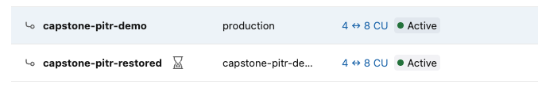
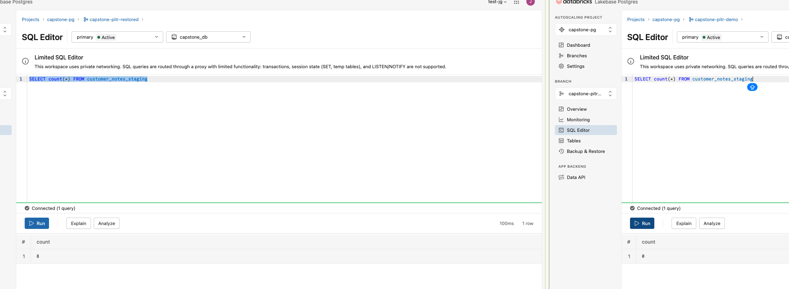
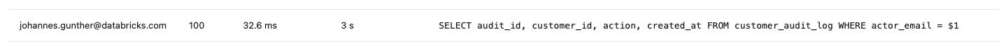
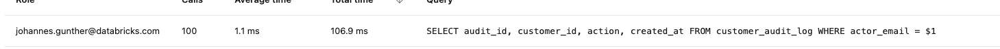

# T9 — Lakebase ops writeup

## T9a — Branch + PITR

- Project `capstone-pg` (Autoscaling, PG 16), 7-day history retention.
- Child branch `capstone-pitr-demo` created from `production` (copy-on-write).
  
- `customer_notes_staging` on the branch: **N = 8** rows.
- `DELETE FROM customer_notes_staging` on the branch → 0 rows; `production`
  unchanged at **8** rows (isolation proof — the app's live data is safe).
- PITR: `capstone-pitr-restored` created from the branch at T0 (before the
  delete) via `source_branch_time` → **8** rows recovered (== N).
  

## T9b — Query insights

Query: `SELECT ... FROM customer_audit_log WHERE actor_email = 'perf500@example.com'`
on `capstone-perf-demo`, seeded with 200k rows across 1000 actor_emails.
Target `perf500@example.com` matches **200 rows** out of 200,024 total.

| | p50 | p95 | p99 | plan |
|---|---|---|---|---|
| Before (no index) | 66.17 ms | 76.02 ms | 90.29 ms | Seq Scan |
| After `CREATE INDEX ... (actor_email)` | 33.76 ms | 36.40 ms | 40.98 ms | Bitmap Index Scan on idx_audit_actor_email |

> **Note on AFTER plan:** Postgres chose a Bitmap Index Scan (inside a Bitmap Heap Scan) rather than a plain Index Scan. This is normal for ~200 scattered heap pages at ~0.1% selectivity — the index `idx_audit_actor_email` is fully used. EXPLAIN execution time confirmed the gain: 34.8 ms → 0.5 ms (server-side). Server-side `pg_stat_statements` after indexing: `mean_exec_time = 1.059 ms` (100 calls).

 

Takeaway: the unindexed predicate forces a full sequential scan of the audit
log; a btree on `actor_email` turns it into an index scan, cutting p95 from
76.02 ms to 36.40 ms.
